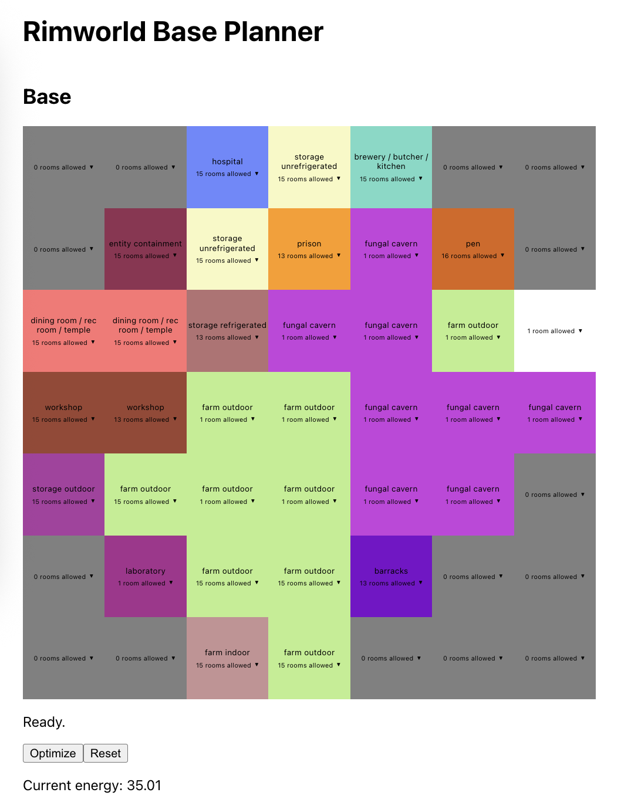
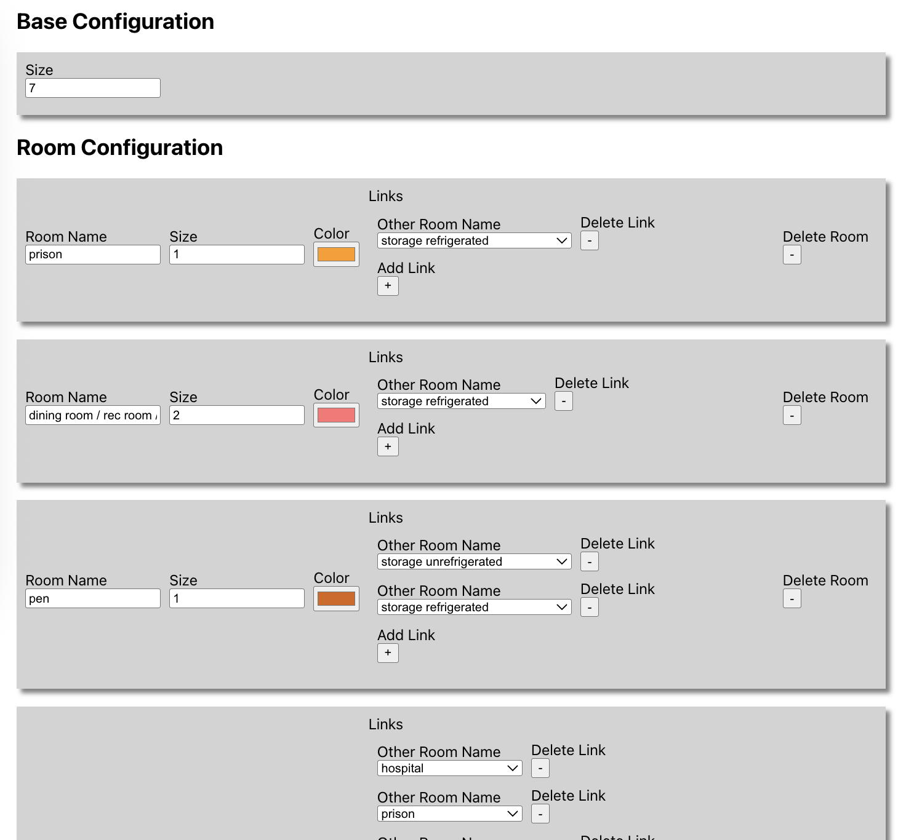
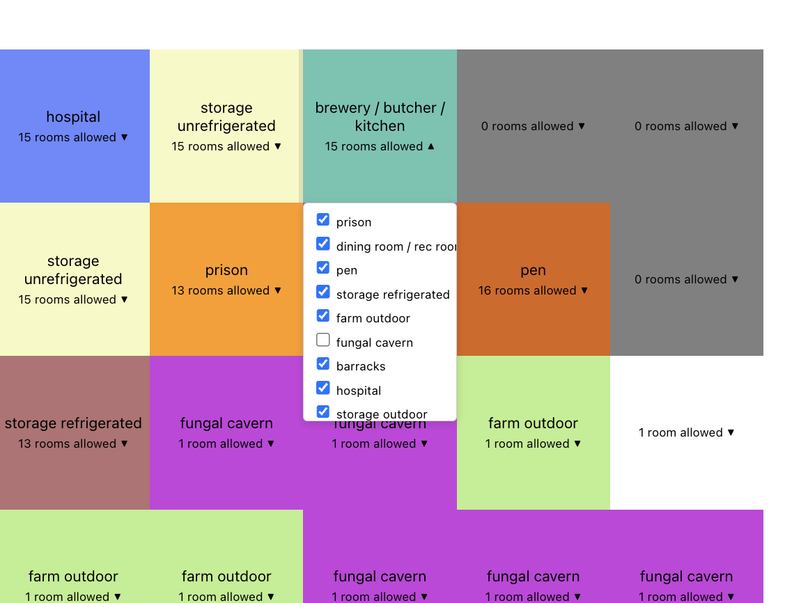

# rimworld-base-planner

This tool optimizes a [Rimworld](https://rimworldgame.com/) base layout. It uses [simulated annealing](https://en.wikipedia.org/wiki/Simulated_annealing) to settle on an approximate global optimum that minimizes colonist traffic and maximizes productivity.



# Setup

1. Install dependencies.
    ```
    npm ci
    ```

# Usage

1. Start the dev server.
    ```
    npm start
    ```
1. Go to https://localhost:3000.
1. Add rooms. Configure their sizes, and which other rooms they should be near in order to minimize traffic.
    

1. Configure the cells. Choose which rooms should be allowed in each cell.
    

1. Optimize!
